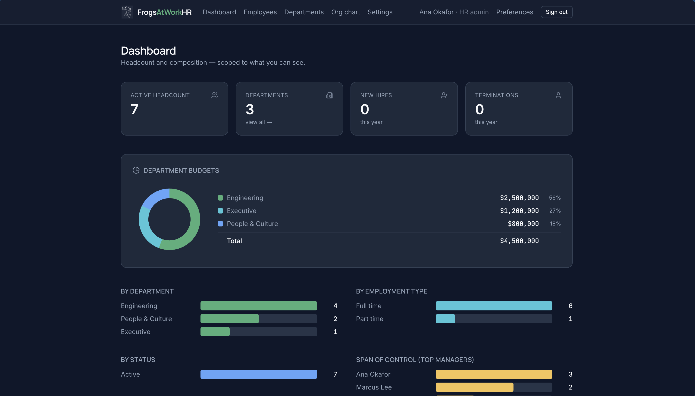
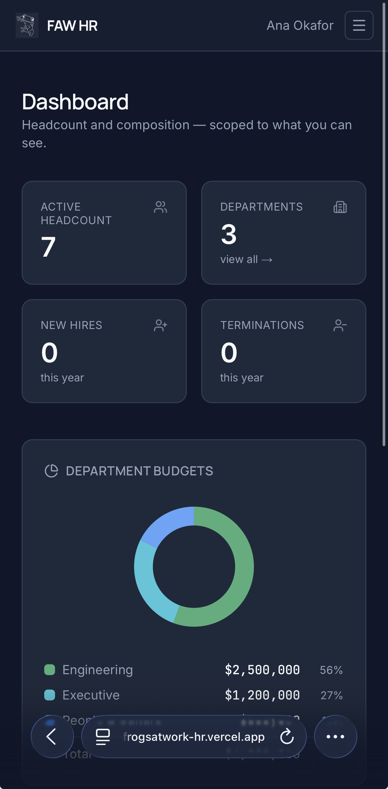

# FrogsAtWorkHR

[](https://github.com/Ink710/frogsatwork-hr/actions/workflows/ci.yml)

> A lightweight, compliance-credible **HRIS** suite for managing employee records _and_ time &
> attendance across an organization. _Let's jump into it._

**▶ Live demos** — sign in with a seeded account below (password `password123`):

- **Employee Records:** https://frogsatwork-hr.vercel.app
- **Time & Attendance:** _(link added after deploy)_

FrogsAtWorkHR is a portfolio project built to demonstrate full-stack engineering judgment, not just
CRUD mechanics. The domain decisions reflect how HR data actually behaves in the real world —
records are **never hard-deleted**, changes are **effective-dated**, and sensitive data like
compensation is guarded **on the server**, not just hidden in the UI.

It's a **two-app monorepo suite** sharing one database, auth, and design system:
**Employee Records** (the system of record) and **Time & Attendance** (PTO, timesheets,
scheduling, and clock-in/out) — same sign-in, same security model.

## Screenshots

| Employee directory (desktop) | Responsive (mobile) |
| --- | --- |
|  |  |

---

## Why it's different

Most "employee CRUD" demos overwrite data and hide fields in the frontend. Real HR systems can't:

- **Never hard-delete.** Employees are soft-deleted (status + termination metadata). Records must be
  retained for compliance; a terminated employee can even be rehired, restoring their history.
- **Effective-dated records.** A change to title, salary, or department doesn't overwrite the
  current value — it closes the current version and opens a new dated one. You can view an
  employee's full timeline. (This is the signature feature.)
- **Authorization is about _data_, not screens.** Role-based visibility is enforced in the database
  and the API. A manager can only see their reports; compensation is unreadable outside a viewer's
  authority — even in raw API responses and audit diffs.

## Features — Employee Records

- **Effective-dated employee records** with a full versioned timeline (temporal history model).
- **Corrections vs. changes** — a genuine change opens a new version; a mistake can be corrected
  in place, but only within a 7-day grace window.
- **Soft-delete lifecycle** — terminate (with reason + rehire eligibility) and rehire.
- **Reversible status changes** — place on leave / suspend, then reinstate, retained as spans.
- **Role-based access control** — five roles (HR Admin, HR Generalist, Payroll Admin, Manager,
  Employee) with strict, database-enforced data scoping.
- **Compensation guard** — salary and pay data are gated by a dedicated authority check everywhere
  they could surface (profile, history, audit log).
- **Org chart** — the complete company hierarchy (recursive), visible to everyone but exposing no
  personal data of records you can't open.
- **HR dashboard** — headcount, composition, span-of-control, and department budget aggregations.
- **Append-only audit log** — every mutation recorded, with a cursor-paginated per-employee viewer
  and compensation redaction for viewers who lack authority.
- **Invite / set-password flow** — new hires are emailed a one-time invite (via Mailpit in dev).
- **Emergency contacts**, **departments + budgets**, **private document uploads** (signed URLs).
- **Internationalization** (English / Spanish, cookie-based) and **light/dark theming** (per-user,
  no flash of the wrong theme).
- **Search, filter, and pagination** on the employee list.

## Features — Time & Attendance

The second app in the suite, sharing the same users, roles, and security model:

- **Time off / PTO** — request, approve, and deny leave against a **ledger-based balance** (balance =
  sum of signed rows, auditable), with **automatic monthly accrual** (proration on hire, capped) and
  an overdraw warning.
- **Timesheets** — weekly grids with **California "greater-of" overtime** (daily > 8h vs weekly > 40h,
  non-exempt only) plus **daily double-time** (> 12h); overtime is _derived_, never stored.
- **Scheduling** — a weekly shift calendar (assigned or **open** shifts), batch shift creation,
  manager publish, and **drop/swap requests** routed through a unified approvals inbox.
- **Attendance** — clock in/out with a live "worked today" counter, derived daily status
  (on-time / late / short / absent), a **weekly team roster** with approved-leave overlay, and
  **append-only corrections** (a manual punch, never a mutated row).
- **Meetings** — weekly recurring activities that pre-fill suggested timesheet lines.
- **Time dashboard** — a role-aware snapshot (self for everyone; team oversight for managers/HR).
- **Approvals inbox** — one place for leave, timesheets, and shift swaps.
- **Timezone-correct** — instants are stored UTC and displayed in the viewer's zone (cookie-based),
  including day/week boundaries.
- **Login rate limiting** — see _Architecture highlights_.

## Architecture highlights

These are the parts worth reading the code for:

- **Two-role database security.** Migrations and seeding connect as the Postgres **owner**
  (`DIRECT_URL`); the running app connects as a **restricted `hris_app` role** (`DATABASE_URL`) via
  the Prisma 7 `pg` driver adapter. The app can never run DDL or bypass its own guardrails.
- **Postgres Row-Level Security (RLS) + an app-layer guard.** RLS policies scope which employee
  rows a viewer can see at all, driven by per-request session variables set inside a transaction
  (`withViewer`). On top of that, a pure authorization layer decides field-level access (e.g.
  compensation). The principle: **RLS never decides authorization alone** — it's defense in depth.
- **Append-only audit, enforced in the database.** `UPDATE`/`DELETE` are revoked from `hris_app`
  on the audit table, so the application _cannot_ rewrite history even with a bug.
- **Temporal history model.** Each employee has an ordered set of `EmployeeHistory` versions with
  `effectiveFrom`/`effectiveTo`; exactly one open version at a time is an invariant enforced by the
  write paths.
- **Typed contracts.** Validation lives in Zod schemas shared across server actions and forms; the
  static TypeScript types are **derived from those schemas** (`z.infer`) so they can't drift.
- **Deliberately minimal login rate limiting.** The Time & Attendance login is throttled per client
  IP with Upstash Redis, kept at the **bare operational minimum** on purpose: a **fixed window**
  (one auto-expiring integer counter, ~one Redis command per attempt — no large payloads), analytics
  **off** (no extra keys written), an in-memory **ephemeral cache** so repeated blocked attempts on a
  warm instance never touch Redis, and **IP-only keys** (no email/PII stored). It's **env-gated** — if
  the Upstash vars are absent (local dev, tests), it's a transparent no-op and Redis is never
  contacted. See `apps/time-management/lib/rate-limit.js`.

## Tech stack

**Next.js 16** (App Router, Server Actions) · **React 19** · **Prisma 7 + PostgreSQL 16** ·
**Auth.js v5** (credentials + JWT, bcrypt) · **Tailwind CSS v4** · **TypeScript 5** ·
**Turborepo + pnpm** workspaces · **Vitest** · **nodemailer + Mailpit** · **lucide-react** ·
**Upstash Redis** (login rate limiting) · **Vercel Cron** (monthly PTO accrual).

## Monorepo layout

```
apps/
  employee-records/     Next.js app — system of record (UI, routes, server actions) · :3000
  time-management/      Next.js app — time & attendance (PTO, timesheets, scheduling, clock) · :3001
packages/
  database/             Prisma schema, migrations, seed, two-role client (@hris/database)
  auth/                 Auth.js config, RBAC predicates, RLS helpers, session (@hris/auth)
  types/                Shared Zod schemas + inferred TypeScript types (@hris/types)
  workable-hours/       Time-domain Zod schemas + pure rules (overtime, accrual, totals) (@hris/workable-hours)
  ui/, notifications/   Reserved shared-package slots for future apps
```

## Local development

**Prerequisites:** Node 24+, pnpm 11+, Docker.

```bash
# 1. Start Postgres (:5433) and Mailpit (SMTP :1025, web UI :8025).
#    On first run, the container also creates the restricted `hris_app` runtime role
#    (see docker/init/01-app-role.sql).
docker compose up -d

# 2. Install dependencies
pnpm install

# 3. Configure environment
cp .env.example .env            # then set AUTH_SECRET (see below)
#    generate one with:  openssl rand -base64 32

# 4. Apply migrations (schema, RLS policies, grants), then seed demo data
pnpm --filter @hris/database db:deploy
pnpm --filter @hris/database db:seed

# 5. Run an app
pnpm --filter employee-records dev    # Employee Records  → http://localhost:3000
pnpm --filter time-management dev      # Time & Attendance → http://localhost:3001
```

Both apps share the same database and `AUTH_SECRET`, so a single sign-in works across the suite in
local dev.

Invite emails are captured by Mailpit — open the web UI at **http://localhost:8025** to view them.

### Seeded logins

All demo accounts use the password **`password123`**:

| Email                          | Role           | Sees                         |
| ------------------------------ | -------------- | ---------------------------- |
| `ana.okafor@frogsatwork.test`  | HR Admin       | everyone, all fields         |
| `bianca.ross@frogsatwork.test` | HR Generalist  | everyone, no restricted comp |
| `nadia.cole@frogsatwork.test`  | Payroll Admin  | comp across the org          |
| `marcus.lee@frogsatwork.test`  | Manager        | their reports only           |
| `diego.santos@frogsatwork.test`| Employee       | only their own record        |

(`priya.nair@` and `tom.becker@frogsatwork.test` are additional Employees.)

## Testing

```bash
pnpm test           # unit + integration (246 tests: 108 unit + 138 integration)
```

Unit tests cover the pure logic (RBAC predicates, overtime/accrual rules, formatters, validation).
Integration tests run against a real Postgres (`hris_test`), which the harness bootstraps
automatically — they exercise RLS scoping, the compensation guard, the approval gates, and the write
paths end-to-end across both apps.

## Environment & secrets

- Real secrets live in **`.env`** (and `.env.local`), which are **git-ignored** — nothing sensitive
  is committed. `AUTH_SECRET` is the only value you must generate yourself.
- **`.env.test`** _is_ committed on purpose: it holds only `localhost` credentials for a throwaway
  test database, so CI works with no extra setup.
- The app reads all secrets from `process.env` — none are hardcoded.

## Status & roadmap

Both apps are feature-complete. **Employee Records** is deployed (Vercel + Neon Postgres);
**Time & Attendance** deploys as a second Vercel project against the same database
(runbook in [`docs/DEPLOYMENT.md`](docs/DEPLOYMENT.md)). **Next:** a lightweight ATS ("hire" flow)
that plugs into the existing employee-creation path.

---

_Built as a portfolio project. The HR-domain decisions come from real org-wide HR administration
experience — they're the point, not an afterthought._
