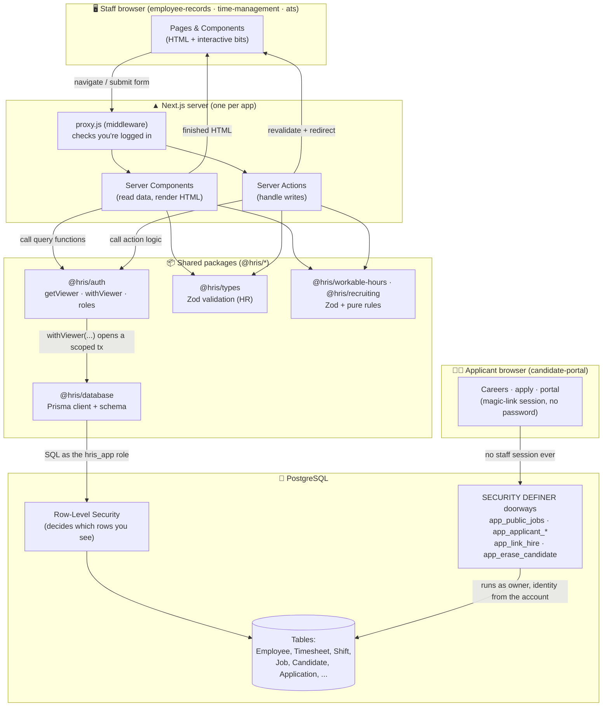
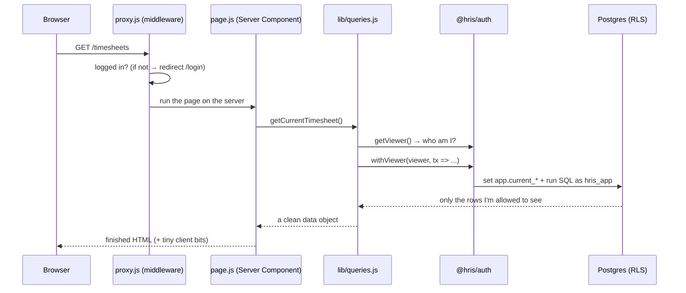
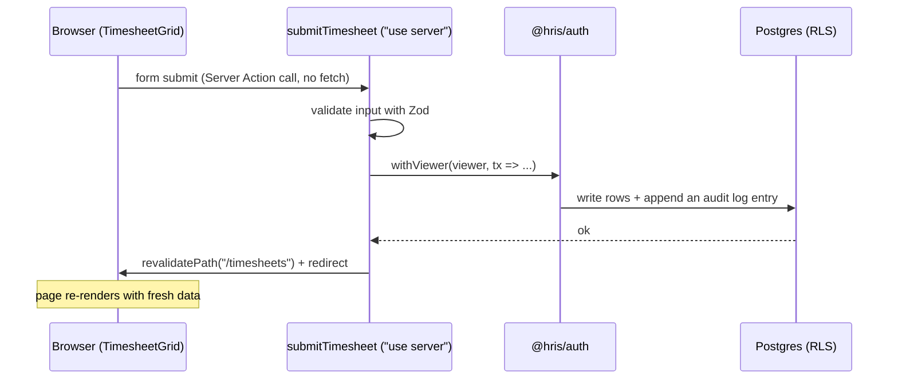

# FrogsAtWork HR — Architecture & Onboarding Guide

> **Who this is for:** a developer just joining the team. By the end you'll understand what
> the product is, how the code is organized, how data flows from the database to the screen and
> back, and where to look when you need to change something. No prior knowledge of this codebase
> is assumed. Jargon is explained the first time it appears, and there's a [Glossary](#12-glossary)
> at the bottom.

---

## Table of contents

1. [The product in one minute](#1-the-product-in-one-minute)
2. [The mental model (read this first)](#2-the-mental-model-read-this-first)
3. [Architecture overview (the big picture)](#3-architecture-overview-the-big-picture)
4. [The monorepo layout — files & modules](#4-the-monorepo-layout--files--modules)
5. [Backend](#5-backend)
6. [Frontend](#6-frontend)
7. [Interfaces (pages) — what each screen shows](#7-interfaces-pages--what-each-screen-shows)
8. [Routes reference](#8-routes-reference)
9. [Connections — how frontend and backend talk](#9-connections--how-frontend-and-backend-talk)
10. [Security model — the one thing you must understand](#10-security-model--the-one-thing-you-must-understand)
11. [Running it locally](#11-running-it-locally)
12. [Glossary](#12-glossary)
13. [The seams — where to read next](#13-the-seams--where-to-read-next)

---

## 1. The product in one minute

**FrogsAtWork HR** is a small **HR software suite** made of **four web apps** that share one
database:

| App | Folder | Port | What it does |
|-----|--------|------|--------------|
| **Employee Records** | `apps/employee-records` | 3000 | The HR core: employee profiles, salaries, departments, the org chart, and a full **dated history** of every change. |
| **Time Management** | `apps/time-management` | 3001 | Time & Attendance: time-off/PTO, weekly timesheets, shift scheduling, clock in/out, recurring meetings, and manager approvals. |
| **Recruiting (ATS)** | `apps/ats` | 3002 | Hiring: requisitions, a public careers page, the candidate pipeline, scorecards, salary bands and offers, EEO reporting and GDPR erasure. |
| **Candidate Portal** | `apps/candidate-portal` | 3003 | The applicant's side: browse openings, apply, then sign in by magic link to track status, manage a résumé and profile, and self-schedule interviews. |

**The first three are *staff* apps and the fourth is not**, and that line matters more than it
looks. The staff apps share the same `User` table and the same login secret, so signing into one
signs you into the others (on localhost) — it feels like one product. The Candidate Portal is a
**separate authentication realm**: applicants are not users, they have no password, they sign in by
emailed magic link, and the portal has its own secret and its own cookie. An HR admin's session
means nothing there, and an applicant's session means nothing in the ATS. See
[`docs/modules/auth-realms.md`](modules/auth-realms.md).

The apps do connect for real, through two deliberate **seams**:

- **The hire seam** — when a candidate is hired, they become an employee through a single audited
  function rather than by the ATS writing an `Employee` row.
  See [`docs/modules/hire-seam.md`](modules/hire-seam.md).
- **The portal seam** — the portal reads candidate data the ATS owns without sharing any code with
  it, through a family of narrow database functions.
  See [`docs/modules/portal-seam.md`](modules/portal-seam.md).

Two domain rules shape almost everything:

- **We never hard-delete people or records.** A terminated employee is marked, not deleted.
  A change to a salary or title doesn't overwrite the old value — it creates a new dated
  version. HR software has to keep history for compliance.
  *(The ATS is the deliberate exception, and it's worth understanding why: a job applicant is not
  an employee, so no employment-retention duty outranks their right to erasure. Candidate data is
  genuinely destroyed on request — see § erasure.)*
- **Who can see what is strict.** An employee sees only their own data. A manager sees their
  team (and their team's team, recursively). HR sees everyone. Salaries are extra-guarded.
  *(The ATS uses a second, different model on top: access follows the **hiring team of a specific
  requisition**, not the org chart. A manager's reports are irrelevant to whether they can see a
  candidate.)*

---

## 2. The mental model (read this first)

If you've built apps with a separate "backend API" (Express, FastAPI, etc.) where the browser
calls `fetch('/api/...')`, **put that model aside** — this app works differently.

This is a **Next.js App Router** app. There are really only **two ways data moves**:

1. **Reading data → Server Components.** A page is an `async` function that runs *on the server*.
   It calls a query function directly (no HTTP), gets the data, and renders HTML. The browser
   receives finished HTML.

   ```jsx
   // apps/time-management/app/timesheets/page.js  (runs on the server)
   export default async function TimesheetsPage() {
     const current = await getCurrentTimesheet();   // ← direct function call, not fetch()
     return <TimesheetGrid initialEntries={current.entries} /* ... */ />;
   }
   ```

2. **Writing data → Server Actions.** A form's `action` points at a server function marked
   `"use server"`. When the user submits, Next.js calls that function on the server with the
   form data. No API endpoint, no `fetch` — you just call the function.

   ```jsx
   // A "use server" function, imported straight into a form:
   <form action={submitTimesheet}> ... </form>
   ```

So **there is almost no REST API.** The only real HTTP routes are login, a health check, a file
download, a magic-link redemption and two scheduled cron jobs (see [Routes](#8-routes-reference)).
Everything else is "call a function on the server." Keep this in mind — it's the single biggest
difference from a classic frontend-talks-to-backend app.

> **Jargon:**
> **Server Component** = a React component that runs on the server and can `await` data; it never
> ships to the browser. **Client Component** = a normal interactive React component (has a
> `"use client"` line at the top, can use `useState`, `onClick`, etc.). **Server Action** = a
> function marked `"use server"` that runs on the server and can be called from a form or a
> button.

---

## 3. Architecture overview (the big picture)



> **The two paths into the data are different on purpose.** Staff traffic goes *through* RLS: the
> session says who you are, and Postgres filters the rows. Applicant and public traffic has no staff
> session at all, so instead of loosening a policy it goes through a **doorway** — a narrow
> `SECURITY DEFINER` function that runs with the owner's rights and derives the caller's identity
> itself. Widening a policy would have weakened it for everyone; a doorway adds exactly one
> capability and nothing else. [§10](#10-security-model--the-one-thing-you-must-understand) explains
> the rules that keep doorways safe.

**How to read this:** the browser asks for a page or submits a form → middleware checks you're
logged in → a Server Component (read) or Server Action (write) runs → it uses `@hris/auth` to
open a **security-scoped** database transaction → Prisma runs SQL as a restricted database user →
**Postgres itself** filters the rows down to what you're allowed to see → the result comes back
and the browser gets HTML.

**The layers, from the graph:**

- **Entry layer** = the four apps. They only *call out*. Three of them depend on `@hris/auth`;
  `candidate-portal` deliberately does not (it wires its own Auth.js in `lib/auth.js`).
- **Core layer** = `@hris/auth` (used across the staff apps), `@hris/workable-hours` (the time-math
  rules) and `@hris/recruiting` (the hiring rules, shared by the ATS **and** the portal). These
  hold the reusable brains.
- **Leaf layer** = `@hris/types` (validation), `@hris/database` (data access), `@hris/storage`
  (files) and `@hris/notifications` (candidate email) — used by others, depend on little.

The whole graph is only two levels deep: `@hris/auth → @hris/database` is the *only* runtime
dependency between packages. Every domain package (`types`, `recruiting`, `workable-hours`) has
**zod as its single dependency** and mirrors the Prisma enums as local `as const` tuples rather than
importing them — that is what keeps them testable without a database.

---

## 4. The monorepo layout — files & modules

This is a **monorepo** (many packages in one repository) managed by **pnpm workspaces** +
**Turborepo** (a build tool that runs tasks across packages).

```
hris-monorepo/
├── apps/
│   ├── employee-records/      # HR core app (Next.js)          :3000
│   ├── time-management/       # Time & Attendance app          :3001
│   ├── ats/                   # Recruiting app + /careers      :3002
│   └── candidate-portal/      # Applicant-facing app           :3003
├── packages/                  # shared code the apps import
│   ├── database/              # @hris/database — Prisma schema, client, seed, ALL migrations
│   ├── auth/                  # @hris/auth    — login + security helpers (staff apps only)
│   ├── types/                 # @hris/types   — Zod schemas for employee-records
│   ├── workable-hours/        # @hris/workable-hours — Zod + pure time rules
│   ├── recruiting/            # @hris/recruiting — Zod + pure hiring rules (ats + portal)
│   ├── storage/               # @hris/storage — swappable object storage (local | vercel-blob)
│   ├── notifications/         # @hris/notifications — candidate email templates + transport
│   └── ui/                    # @hris/ui      — shared components, i18n + theme plumbing
├── test/                      # shared test harness (resetDb, globalSetup, mailbox)
├── docker-compose.yml         # runs PostgreSQL locally (port 5433)
├── .env                       # database connection strings (not committed)
└── docs/                      # you are here
    ├── ARCHITECTURE.md        # this file
    ├── DEPLOYMENT.md          # the deploy runbook
    ├── modules/               # the seams — contracts that span several files
    └── decisions/             # ADRs — why things are the way they are
```

**Inside a single app** (they share the same shape):

```
apps/time-management/
├── app/                       # every folder here = a URL route (App Router)
│   ├── page.js                # the "/" page (a Server Component)
│   ├── layout.js              # wraps every page (header, theme, fonts)
│   ├── login/page.js          # the sign-in screen
│   ├── timesheets/
│   │   ├── page.js            # GET /timesheets (reads + renders)
│   │   └── actions.js         # "use server" write functions for timesheets
│   └── api/                   # the few real HTTP endpoints
├── components/                # reusable React components (TimesheetGrid, AppHeader, ...)
├── lib/
│   ├── queries.js             # ALL database reads for this app live here
│   ├── i18n.ts / i18n.server.js  # English/Spanish translation helpers
│   └── format.ts              # date/number formatting
├── proxy.js                   # middleware: redirects to /login if not signed in
└── public/brand/              # logo images
```

**The one file you'll open most: `lib/queries.js`.** Every screen's data comes from a function
in there. Reads live in `lib/queries.js`; writes live in the `actions.js` next to each route.

**Two places this shape bends, both worth knowing before you go looking for a file:**

- **`apps/ats` groups its routes.** `app/(internal)/` is the authenticated recruiter app and
  `app/careers/` is the public site, with its own `layout.js` and no session at all. The
  parentheses make a **route group**: it organises files without appearing in the URL, so
  `app/(internal)/jobs/page.js` serves `/jobs`, not `/internal/jobs`.
- **`apps/candidate-portal` inverts the middleware.** In the three staff apps `proxy.js` protects
  everything *except* a short allow-list. In the portal most of the site is public and only
  `/portal/*` is protected, so its matcher is the other way round. **Where you put a file there
  decides whether it is public** — read `proxy.js` before adding a route.

> **Gotcha that cost a production 404:** a `loading.js` at the root of `app/` wraps *every* route,
> and because the loading boundary flushes a `200` before the page resolves, `notFound()` further
> down can no longer set the status — every bad URL becomes a **soft 404** (404 page, `200`
> status). The fix is to scope the boundary with a route group: `app/(browse)/loading.js` covers
> only the browse pages. See ADR-011.

---

## 5. Backend

"Backend" here = the code that runs on the server: the shared packages, the query functions, and
the Server Actions.

### 5.1 Files & modules (the shared packages)

| Package | Responsibility | Key exports |
|---------|----------------|-------------|
| **`@hris/database`** | The single source of truth for the data model. Holds the Prisma **schema** (all tables), the shared Prisma **client** (one connection pool), and the **seed** script (demo data). | `prisma`, `SYSTEM_USER_ID`, generated enums |
| **`@hris/auth`** | Login (Auth.js) + the security helpers every read/write uses. **Staff apps only** — `candidate-portal` has its own. | `getViewer`, `withViewer`, `isHrRole`, `getSubtreeIds`, `canApproveForEmployee` |
| **`@hris/types`** | **Zod** validation schemas for the HR app (employee create/change/terminate, etc.), plus small rules like the 7-day correction window. Employee domain only — the hiring vocabulary lives in `@hris/recruiting`. | `employeeChangeSchema`, `terminationSchema`, ... |
| **`@hris/workable-hours`** | **Zod** schemas *and* **pure functions** (no database) for the time app: overtime math, PTO balances, attendance verdicts, meeting durations. | `computeTimesheet`, `computeAttendanceDay`, `computeBalances`, `meetingDurationHours`, `timeEntrySchema`, ... |
| **`@hris/recruiting`** | The same idea for hiring: **Zod** schemas + **pure rules** with no database — which pipeline moves are legal, interview-round ordering, scorecard completeness, offer lifecycle and compa-ratio, EEO suppression, retention eligibility, and the internal-stage → applicant-facing-status mapping. Shared by **`ats` and `candidate-portal`**, which is how the two agree on vocabulary without sharing code. | `canTransition`, `hasRemainingRounds`, `classifyOffer`, `isScorecardComplete`, `suppressSmallCells`, `isEligibleForArchive`, `formatCallWindow`, ... |
| **`@hris/storage`** | Swappable object storage behind one three-method interface (`put` / `getStream` / `remove`), chosen with `STORAGE_DRIVER`. `local` and `vercel-blob` are implemented; `s3`/`r2` are declared and throw until written. | `createStorage` |
| **`@hris/notifications`** | Candidate-facing email: the templates, the delivery wrappers, and a **swappable nodemailer transport isolated in one file** so tests can replace it without a mail server. | `candidateStageEmail`, `interviewerSlotEmail`, `sendMail` |
| **`@hris/ui`** | Shared presentational components and the i18n/theme plumbing, split into three subpath exports so a server-only module never poisons a client bundle. | `@hris/ui`, `@hris/ui/client`, `@hris/ui/server` |

> **Jargon: Zod** is a validation library. You describe the shape data *should* have
> (`z.object({ name: z.string().min(1) })`) and it checks real input against it, returning either
> clean data or friendly error messages. We use it so bad form input never reaches the database.
>
> **Jargon: Prisma** is the **ORM** (Object-Relational Mapper) — a library that lets you read/write
> the database with JavaScript (`prisma.employee.findMany(...)`) instead of writing raw SQL.

### 5.2 Functions (the important ones)

**`getViewer()`** — *"Who is asking?"* Reads the logged-in session and returns a small object
describing the current user. This is the **most-used function in the codebase** (128 call sites).

```js
const viewer = await getViewer();
// → { userId, employeeId, role: "MANAGER", orgId }  (or null if not logged in)
```

**`withViewer(viewer, async (tx) => { ... })`** — *"Run these queries as this person."* This is
the heart of the security model (2nd most-used function). It opens a database **transaction**,
tells Postgres who the viewer is, then runs your queries inside that scope so the database only
returns rows the viewer is allowed to see. You almost never touch `prisma` directly for user data —
you go through `withViewer`.

```js
return withViewer(viewer, async (tx) => {
  // Inside here, tx.employee.findMany() only returns employees this viewer may see.
  return tx.timesheet.findMany({ where: { employeeId: viewer.employeeId } });
});
```

**Role helpers** (`packages/auth/src/roles.ts`) — small yes/no checks used to gate actions:

```js
isHrRole(viewer.role)                 // true for HR_ADMIN / HR_GENERALIST
canApproveForEmployee(viewer, id, { subtreeIds })  // may this viewer approve for that person?
```

**Pure rule functions** (`@hris/workable-hours`) — plain math, no database, easy to test. Example:

```js
// Given a week of daily hours, work out regular vs. overtime (California rules):
computeTimesheet([{ workDate: "2026-07-27", hours: 10 }, ...], "NON_EXEMPT")
// → { total: 42, regular: 40, overtime: 2, doubletime: 0, byDay: {...} }
```

Because these are pure functions, the **same code runs on the server (to store the truth) and in
the browser (to show a live preview as you type)** — so what the user sees always matches what
gets saved.

**Doorway functions (`app_*` in the database)** — the third kind, and the one that surprises
people, because this logic lives in **SQL, not JavaScript**. There are 47 of them. They exist for
callers who have no staff session and therefore cannot pass through RLS: the public careers page
and the whole Candidate Portal. Each is `SECURITY DEFINER` (it runs with the table owner's rights)
with a pinned `search_path`, and each grants exactly one capability.

| Family | Count | Examples | Called by |
|--------|-------|----------|-----------|
| Row-visibility predicates | 15 | `app_can_see_employee`, `app_can_manage_job`, `app_can_see_candidate` | **Inside RLS policies**, not by app code |
| Org-tree walks | 4 | `app_subtree`, `app_ancestors`, `app_org_chart` | `@hris/auth`'s `scope.ts` |
| Public (no session at all) | 3 | `app_public_jobs`, `app_public_job_questions`, `app_submit_application` | ATS `/careers`, portal browse + apply |
| Applicant portal | 11 | `app_applicant_applications`, `app_applicant_resume`, `app_applicant_claim_slot` | `apps/candidate-portal/lib/queries.js` |
| Candidate identity | 3 | `app_issue_candidate_login`, `app_redeem_candidate_login`, `app_close_candidate_account` | Portal sign-in; ATS onboarding |
| Staff-side: seams, slots, notifications, compliance | 11 | `app_link_hire`, `app_erase_candidate`, `app_eeo_filing`, `app_claim_interview_slot`, `app_claim_notification` | The seams; see `docs/modules/` |

```js
// A portal read never touches a table directly. It calls a doorway and passes the ACCOUNT id:
const rows = await prisma.$queryRaw`SELECT * FROM app_applicant_applications(${accountId})`;
```

> ⚠️ **The rule that makes this safe:** an applicant doorway takes the **account id** and derives
> everything else from it. It never accepts an application id, a candidate id or a job id from the
> caller, because a `SECURITY DEFINER` function that trusts an id from an untrusted caller is just
> an authorization bypass with extra steps. The one staff-facing doorway that *does* take an id is
> safe only because `app_can_manage_job` stands in front of it. Keep that split.
> Full rules in [`docs/modules/portal-seam.md`](modules/portal-seam.md).

### 5.3 Queries (reading data)

All reads for an app live in its `lib/queries.js`. A query function follows a consistent recipe:

```js
export async function getCurrentTimesheet(weekStartStr = null) {
  const viewer = await getViewer();                 // 1. who is asking?
  if (!viewer?.employeeId) return null;             // 2. guard
  return withViewer(viewer, async (tx) => {         // 3. open a secure transaction
    const timesheet = await tx.timesheet.findUnique({ /* ... */ });   // 4. read (RLS-scoped)
    return { /* shaped result for the UI */ };      // 5. return a clean object
  });
}
```

A few real examples and what they're for:

| Query | Purpose |
|-------|---------|
| `getCurrentTimesheet()` | This week's timesheet for the logged-in employee, with live overtime. |
| `getTeamAttendanceWeek(week)` | A manager's weekly attendance **roster** (each report × 7 days). |
| `getTimeOffOverview()` | PTO balances + pending requests for the employee. |
| `getPendingTimesheets()` | Timesheets awaiting *this manager's* approval. |
| `getManagedMeetings()` | Recurring meetings this manager owns. |

> **Prisma read, in plain terms:** `tx.timesheet.findUnique({ where: {...}, include: { entries: true } })`
> means *"find one timesheet matching these conditions, and bring its related time-entry rows along."*
> It's SQL, written as JavaScript.

### 5.4 Server Actions (writing data)

Writes live in `actions.js` files next to each route, each marked `"use server"`. The recipe
mirrors reads, plus it validates input, writes an **audit log** row for sensitive changes, and
tells the page to refresh:

```js
"use server";
export async function submitTimesheet(weekStartStr, _prev, formData) {
  const viewer = await getViewer();
  const entries = timesheetEntriesSchema.parse(JSON.parse(formData.get("entries"))); // validate
  await withViewer(viewer, async (tx) => {
    // ... upsert the timesheet + its rows, set status SUBMITTED ...
    await tx.employeeAuditLog.create({ data: { eventType: "TIMESHEET_SUBMIT", /* ... */ } });
  });
  revalidatePath("/timesheets");   // tell Next the page's data changed
  redirect("/timesheets");         // send the user back to the list
}
```

Representative actions: `submitTimesheet`/`approveTimesheet` (time), `approveTimeOff`/`denyTimeOff`
(PTO), `createMeeting`/`assignToMeeting` (meetings), `recordChange`/`terminateEmployee`/
`createEmployee` (HR core — these live in `apps/employee-records/app/employees/[id]/actions.ts`).

> Note that HR-core write logic is written in **TypeScript** (`.ts`) — those files were migrated
> from JavaScript so the trickiest, most sensitive logic gets compile-time type checking. Most of
> the rest of the codebase is JavaScript.

### 5.5 Variables & fields (the data model)

The database tables (Prisma **models**) live in `packages/database/prisma/schema.prisma`. The ones
you'll meet first:

| Model | What it is | Notable fields |
|-------|-----------|----------------|
| `Organization` | The company. Everything belongs to one org. | `id`, `name` |
| `User` | A **login identity** + `role`. | `email`, `role`, `passwordHash`, `orgId` |
| `Employee` | A person's **current** state. | `managerId` (self-link → org chart), `departmentId`, `employmentStatus` |
| `EmployeeHistory` | **Dated versions** of an employee's job/salary (see below). | `salary`, `jobTitle`, `effectiveFrom`, `effectiveTo` |
| `Timesheet` / `TimeEntry` | A weekly timesheet and its per-line hours. | `status`, `hours`, `projectId`, `meetingId` |
| `Shift` | A scheduled shift (department roster). | `startAt`, `endAt`, `published` |
| `LeaveRequest` / `LeaveLedgerEntry` | A PTO request and the signed ledger that tracks balances. | `status`, `hours`, `source` |
| `ClockEvent` | One clock punch (IN or OUT). Attendance is *derived* from these. | `at`, `type` |
| `Meeting` / `MeetingAssignment` | A recurring weekly meeting and who's assigned to it. | `dayOfWeek`, `startTime`, `endTime` |
| `EmployeeAuditLog` | An **append-only** record of sensitive actions. | `eventType`, `occurredAt` |

**The signature pattern — effective-dated history.** Instead of overwriting a salary, we keep an
`EmployeeHistory` row per version. The **current** version has `effectiveTo = null`; older versions
have an end date. This lets us answer "what was Diego's title last March?" — and it's why you'll
see terms like *change* (new version) vs. *correction* (fix a version in place, within 7 days).

**The RLS session variables.** When `withViewer` runs, it sets four Postgres settings that the
security rules read: `app.current_user_id`, `app.current_employee_id`, `app.current_role`,
`app.current_org_id`. You won't set these by hand — `withViewer` does it — but knowing they exist
explains how the database "knows who you are." (More in [§10](#10-security-model--the-one-thing-you-must-understand).)

---

## 6. Frontend

"Frontend" = the pages and components the user sees. Remember from [§2](#2-the-mental-model-read-this-first):
pages are **Server Components** by default (they render on the server), and only the interactive
pieces are **Client Components**.

### 6.1 Files & modules

| Location | Responsibility |
|----------|----------------|
| `app/**/page.js` | One page per URL. Usually a Server Component that reads data and renders. |
| `app/layout.js` | The shell around every page: header, fonts, theme, language provider. |
| `components/*.js` | Reusable UI. Some are Server Components, some are Client Components (`"use client"`). |
| `lib/i18n.*` | Translation (`t("timesheets.title")` → "Timesheets" or "Horas"). |
| `lib/format.ts` | Locale-aware date/number formatting. |

### 6.2 Functions & components

**Server Components (most pages, and some components)** — `async`, fetch data, render. Example:
`AttendanceRoster` is a *server* component that receives the week's data and prints the grid table.
It has no interactivity, so it stays on the server (smaller, faster).

**Client Components (`"use client"`)** — anything the user *interacts with*:

- **`TimesheetGrid`** — the editable weekly grid. Holds the rows in React state (`useState`),
  recomputes overtime live with `computeTimesheet` as you type, and submits via a Server Action.
- **`AppHeader`**, **`ThemeToggle`**, **`LanguageToggle`**, forms with validation, etc.

**The form-submission helper you'll see everywhere: `useActionState`.** It wires a Server Action
to a form and gives you back any error message + a "pending" flag so buttons can disable while
saving:

```jsx
"use client";
const [state, action, pending] = useActionState(submitTimesheet.bind(null, week), undefined);
return (
  <form action={action}>
    {state?.error && <p className="text-destructive">{state.error}</p>}
    <button disabled={pending}>Submit</button>
  </form>
);
```

**`useT()` / `t()`** — the translation function. Call `t("some.key")` to get the current
language's text. Server code uses `await getT()`; client components use `const t = useT()`.

### 6.3 Variables & state

- **Server side:** there's little "state" — a page reads fresh data on every request. The important
  server-side values are the `viewer` object and whatever a query returns.
- **Client side:** `useState` holds form input (e.g. the timesheet grid's rows); `useActionState`
  holds the submit error + pending flag. Theme and language are read from a cookie and provided to
  the tree via context providers in `layout.js`.

### 6.4 Frontend routes

Every folder under `app/` with a `page.js` is a route. See the full list in
[§8](#8-routes-reference) and what each renders in [§7](#7-interfaces-pages--what-each-screen-shows).

---

## 7. Interfaces (pages) — what each screen shows

### Employee Records (`apps/employee-records`, port 3000)

| Route | What it shows | Who can reach it |
|-------|---------------|------------------|
| `/login`, `/set-password` | Sign in; new hires set a first password via an invite link. | Everyone (public). |
| `/dashboard` | HR overview: headcount, department rollups. | Signed-in staff. |
| `/employees` | The employee list (with a "New employee" button for HR). | Scoped by role (RLS). |
| `/employees/[id]` | One employee's profile. Salary card is hidden unless you may see comp. | Self / manager / HR. |
| `/employees/[id]/history` | The full dated timeline of that person's job/salary versions. | Manager / HR. |
| `/employees/[id]/edit`, `/correct` | **Change** (new dated version) vs **correct** (fix in place). | HR (comp edits gated further). |
| `/employees/[id]/terminate`, `/rehire`, `/status`, `/reinstate` | Lifecycle events (never a hard delete). | HR_ADMIN. |
| `/employees/[id]/audit` | The append-only audit trail for that person. | Manager / HR. |
| `/employees/[id]/documents` | Files (contracts, IDs). Downloads via a signed link. | Scoped. |
| `/departments`, `/departments/[id]` | Departments, sub-departments, budgets (budget is RLS-guarded). | Scoped. |
| `/org-chart` | The recursive reporting tree. | Scoped. |
| `/settings`, `/preferences` | App settings (HR) and personal theme/language. | Varies. |

### Time Management (`apps/time-management`, port 3001)

| Route | What it shows |
|-------|---------------|
| `/` | Personal "My time" dashboard for everyone; managers/HR also see a team-oversight section. |
| `/time-off`, `/time-off/new`, `/time-off/policies` | PTO balances & requests; file a request; HR sees accrual policies. |
| `/timesheets` | The weekly **line-item** timesheet grid (project *and* meeting activities per day). |
| `/schedule`, `/schedule/shift/...` | The department shift calendar; managers create/publish shifts; employees request swaps. |
| `/attendance`, `/attendance/team`, `/attendance/correct` | Your clock in/out; the **team roster** (Day ↔ Week toggle); manager punch corrections. |
| `/meetings`, `/meetings/[id]` | Managers program recurring meetings and assign people; those flow onto timesheets. |
| `/my-team`, `/my-team/[id]` | Managers review a report's timesheet, adjust it, then approve/reject. |
| `/approvals` | One inbox for pending time-off, timesheets, and shift swaps. |

> **Reusing the same idea across screens:** an *assignment-scoped* pattern powers both **Projects**
> and **Meetings** — a manager creates the thing and assigns specific people, and only assignees can
> pick it on their timesheet. If you learn one, you understand the other.

### Recruiting / ATS (`apps/ats`, port 3002)

| Route | What it shows | Who can reach it |
|-------|---------------|------------------|
| `/careers`, `/careers/[id]` | **Public.** Advertised postings and the apply form (résumé optional). | Anyone, signed out. |
| `/careers/erasure` | **Public.** Ask for your candidate data to be erased. | Anyone, signed out. |
| `/` | Requisitions you can see. | Hiring-team members + recruiters/HR. |
| `/jobs/[id]` | The pipeline board — drag-and-drop stage moves. | Same; moves need *manage*. |
| `/jobs/[id]/applications/[appId]` | One candidate: timeline, your scorecard, the debrief, and the **offer** (managers only). | Hiring team; offer card manage-only. |
| `/jobs/[id]/manage`, `/jobs/new` | Req details, interview rounds, competencies, hiring team, **salary band**. | Managers only (404 otherwise). |
| `/candidates`, `/candidates/[id]` | The searchable talent pool and one person's cross-req history. | Scoped by RLS. |
| `/candidates/leads` | The great-leads pool — people worth revisiting. | Recruiters/HR only. |
| `/reports` | Funnel, sources, time-to-hire/fill, req aging, interviewer load. | Scoped; some sections gated. |
| `/compliance` | EEO aggregates, CSV exports, the erasure queue. | HR only (404 otherwise). |
| `/api/candidates/[id]/resume` | Streams a CV behind a short-lived signed link. | Hiring team, via RLS. |

> **The screen that best explains the security model:** open one application as an interviewer and
> then as a recruiter. Same URL, same code — the interviewer simply has no offer card, because the
> database returned no row, not because the UI hid it.

### Candidate Portal (`apps/candidate-portal`, port 3003)

The applicant's half of the ATS. **Nothing here uses `@hris/auth`, `getViewer` or `withViewer`** —
every row on every screen comes from a doorway function keyed to the signed-in account.

| Route | What it shows | Who can reach it |
|-------|---------------|------------------|
| `/` | **Public.** The advertised openings — the suite's front door. Only the columns `app_public_jobs()` exposes: no openings count, no hiring team, no department. | Anyone, signed out. |
| `/jobs/[id]` | **Public.** One posting. `notFound()` unless it is OPEN *and* published, so guessing the id of a draft or confidential req is indistinguishable from guessing an id that never existed. | Anyone, signed out. |
| `/jobs/[id]/apply` | **Public.** The application form, including the req's custom questions and an optional résumé. Carries a campaign `?source=` through from the listing so attribution survives the click. | Anyone, signed out. |
| `/sign-in` | **Public.** Asks for an email and sends a magic link. **There is no registration** — an account exists only for someone who has actually applied, and is created lazily the first time they ask for a link. | Anyone, signed out. |
| `/portal` | Your applications and their status, your upcoming interviews, and any slots you can still claim. Shows the **screening-call window** when an application is at SCREEN. | Signed-in applicant, own data only. |
| `/portal/profile` | The record you maintain about yourself: contact details, education, employment history, and your résumé. | Signed-in applicant, own data only. |
| `/portal/resume` | Streams your own résumé back to you. Deliberately **unsigned**, unlike the ATS equivalent — you are the only person it can ever serve. | Signed-in applicant, own data only. |

> **The screen that best explains this app:** `/portal`. It asks for nothing but the session, and
> the session carries only an account id. Every row it shows was selected by a function that
> started from that id — so "showing someone else's application" is not a bug you could write in
> this page, because the page never names an application.
>
> **The deliberate non-feature:** applicants cannot book a screening call. The recruiter phones
> them, and the portal shows the **window** during which to be reachable. Self-scheduling exists
> only for interview *slots* a recruiter has already published. See ADR-010.

---

## 8. Routes reference

### Frontend routes
See the tables in [§7](#7-interfaces-pages--what-each-screen-shows) — every `app/**/page.js` is a
frontend route.

### API routes (the only real HTTP endpoints)
There are just a handful, because reads use Server Components and writes use Server Actions:

| Route | App | Returns / does |
|-------|-----|----------------|
| `POST/GET /api/auth/[...nextauth]` | all | Auth.js login/logout/session endpoints. |
| `GET /api/health` | all | A liveness check (returns OK) for deployment monitoring. |
| `GET /api/documents/[id]/download` | employee-records | Streams a document via a short-lived signed link (permission-checked). |
| `GET/POST /api/cron/accrue` | time-management | A scheduled job that grants monthly PTO accrual; guarded by a `CRON_SECRET`, not a user session. |
| `GET /api/candidates/[id]/resume` | ats | Streams a candidate's CV. Three gates: session, a signed link bound to that candidate **and** user, then RLS. |
| `GET /api/eeo-export` | ats | The EEO CSV exports. Deliberately **inside** the proxy matcher so a session is required before the handler runs; the exact-counts variant is HR-only and audited. |
| `GET/POST /api/cron/archive-stale` | ats | The weekly candidate-retention sweep; `CRON_SECRET`-guarded and **fails closed** without it. |
| `GET /sign-in/verify` | candidate-portal | Redeems a magic-link token and starts the applicant session. Single-use and time-boxed; redirects to `/sign-in/invalid` on a spent or expired token. |
| `GET /portal/resume` | candidate-portal | Streams the signed-in applicant's own résumé. **Unsigned by design** — the session is the only identity it needs, because it can only ever serve you your own file. |

### "Write endpoints" = Server Actions
The equivalent of a REST write API is the set of Server Actions in each `app/**/actions.js`
(and the HR core's `actions.ts`). They're the functions listed in [§5.4](#54-server-actions-writing-data).

---

## 9. Connections — how frontend and backend talk

There's no `fetch('/api/...')` for app data. Here's the **full round-trip** for a read and a write.

### Reading a page (e.g. opening `/timesheets`)



### Writing (e.g. submitting a timesheet)



**State updates in practice:** after a write, the action calls `revalidatePath(...)` — that tells
Next.js "the data behind this page changed, re-run its Server Component." The user sees fresh data
without you manually updating any client state. For *live* feedback while typing (before submit),
Client Components like `TimesheetGrid` recompute locally using the same pure rules the server uses.

---

## 10. Security model — the one thing you must understand

Security here has **two independent layers**. Learn both; mixing them up causes bugs.

### Layer 1 — Row visibility (which *rows*), enforced by the database

The database itself decides which rows you can see, using **Row-Level Security (RLS)**. Every
sensitive table has a policy like *"you may see this row if `app_can_see_employee(employeeId)` is
true."* That function knows the rules: HR sees everyone in the org; a manager sees their **subtree**
(their reports, and their reports' reports, recursively); an employee sees only themselves.

This is why `withViewer` matters: it sets the `app.current_*` variables the policy reads. If you
query with plain `prisma` instead of `withViewer`, **no** variables are set and you'll see *nothing*
(or, in a privileged context, everything) — a common beginner mistake. **Rule of thumb: user data
always goes through `withViewer`.**

There are also **two database users**:
- `postgres` (owner) — used only by migrations and Prisma Studio; can do anything, **including
  bypassing RLS** (see the trap below).
- `hris_app` (restricted) — used by the running apps; RLS applies to it, and its privileges are
  where the retention rule actually lives. It is **forbidden from UPDATE/DELETE on the audit log**
  (so history can't be rewritten, even by a bug) and **forbidden from DELETE on `Employee`,
  `EmployeeHistory`, `Candidate` and `Application`**. "Never hard-delete" is therefore a *privilege*
  rather than a convention — there is no code path, and no bug, that can violate it.

> `hris_app` is **not created by any migration**. On a fresh database you must create it by hand
> before `migrate deploy`, because 64 `GRANT ... TO hris_app` statements depend on it existing.
> `docs/deploy/neon-app-role.sql` is the bootstrap. See ADR-005.

### Layer 2 — Column & action guards (a *field* or a *verb*), enforced in app code

RLS filters rows, but it can't hide a single *column*. So **compensation (salary)** is guarded in
app code (`packages/auth/src/roles.ts`, `scope.ts`): a query only *selects* salary when
`canViewCompensation(...)` says so, and Payroll viewing comp writes an audit `VIEW` row. Likewise,
**who may approve** a request is an app-layer check (`canApproveForEmployee`), because "approval" is
an action, not a row you can see.

> **One-line summary:** *RLS decides which rows exist for you; app-layer guards decide which
> sensitive columns and actions you get.*

### Layer 1, second shape — the ATS's per-requisition access

The recruiting app uses the same machinery with a **different question**. Employee visibility asks
*"where are you in the org chart?"*; hiring visibility asks *"are you on this requisition's hiring
team?"* — because a manager's own reports have nothing to do with whether they should see a
candidate. Three `SECURITY DEFINER` functions carry it:

| Function | True when |
|----------|-----------|
| `app_can_see_job(jobId)` | you're a recruiter/HR, **or** any member of that job's hiring team |
| `app_can_manage_job(jobId)` | you're a recruiter/HR_ADMIN, **or** that job's HIRING_MANAGER — **interviewers excluded** |
| `app_can_see_candidate(id)` | you're a recruiter/HR, **or** they applied to a job you can see |

Most ATS tables split their policies: `FOR SELECT` on *see*, `FOR ALL` on *manage*. Three
refinements are worth knowing because they are where the interesting decisions live:

- **Compensation is a separate TABLE, not a column.** `SalaryBand` and `Offer` are governed by
  `app_can_manage_job`, so **interviewers cannot read them at all**. This is the direct consequence
  of Layer 2's limitation: RLS can't hide a column, so anything that must be invisible to *some*
  people who can see the row has to become its own row somewhere else.
- **Scorecards enforce reciprocity, not rank.** You may read a colleague's feedback only once you
  have *submitted your own* — an anti-anchoring rule, enforced in the policy rather than the UI.
- **Anonymous access uses doorways, not holes.** The public careers page has no session, so instead
  of weakening a policy it calls two narrow `SECURITY DEFINER` functions — `app_public_jobs()` to
  read advertised postings and `app_submit_application(...)` to write one. The same pattern carries
  the hire seam (`app_link_hire`) and erasure (`app_erase_candidate`), each of which does something
  no single role is allowed to do directly.

### Layer 1, third shape — doorways, and the rules that keep them safe

The Candidate Portal turns that last bullet into a whole application. An applicant has **no `User`
row, no role and no `app.current_*` variables**, so RLS has nothing to filter on. All 11
`app_applicant_*` functions are the boundary instead. A `SECURITY DEFINER` function runs with the
**owner's** rights, and the owner bypasses RLS entirely — so each one is a deliberate hole, and the
three rules below are what keep it a doorway rather than a breach:

1. **Derive identity; never accept it.** The function takes the **account id** from the session and
   resolves the candidate, the applications and the jobs itself. It never takes an application id
   from the caller. The one staff-side doorway that does (`app_claim_interview_slot`) is safe only
   because `app_can_manage_job` is checked in front of it.
2. **Pin the `search_path`.** `SET search_path = public` on every definition. Without it, a caller
   who can create a schema can shadow a table name and have owner-privileged SQL read their table
   instead of yours.
3. **Guard with `coalesce`, never a bare `NOT IN`.** See the trap below.

> ⚠️ **The trap that shipped, and how it was found.** A role guard written as
> `IF current_setting('app.current_role', true) NOT IN ('HR_ADMIN', ...) THEN RETURN 'FORBIDDEN'`
> looks right and is backwards. With no session the setting is `NULL`, and `NULL NOT IN (...)` is
> **`NULL`, not `TRUE`** — so the `IF` never fires and the guard is skipped entirely. The function
> refused a signed-in recruiter while waving through a connection that had never identified itself.
>
> Two functions had it. The fix is `coalesce(current_setting('app.current_role', true), '')`, and
> the reason it was caught at all is that someone tested the **no-session** case — the one a
> logged-in test never exercises. `apps/ats/tests/hardening.itest.js` locks it.

> ⚠️ **The other trap: the table owner bypasses RLS.** `relforcerowsecurity` is off, so running a
> query as `postgres` returns every row regardless of policy. A tenant-isolation check run as the
> owner once "proved" a cross-tenant leak that did not exist. **The tell: if every persona sees the
> *same* count, RLS is switched off, not leaking.** Always `SET LOCAL ROLE hris_app` before
> believing any result — and run a control that shows the wrong version failing.

---

## 11. Running it locally

> **Jargon: Docker** runs the PostgreSQL database in a container so you don't install Postgres by
> hand. **pnpm** is the package manager (like npm/yarn) this repo uses.

```bash
# 1. Start the database (PostgreSQL on host port 5433)
docker compose up -d

# 2. Set up the database schema + demo data
pnpm --filter @hris/database db:deploy   # apply migrations
pnpm --filter @hris/database db:seed     # load demo employees, timesheets, etc.

# 3. Run an app (pick one)
pnpm --filter employee-records dev        # → http://localhost:3000
pnpm --filter time-management dev         # → http://localhost:3001
pnpm --filter ats dev                     # → http://localhost:3002
pnpm --filter candidate-portal dev        # → http://localhost:3003
```

**Environment.** The staff apps share `AUTH_SECRET`. The Candidate Portal needs its **own**
`CANDIDATE_AUTH_SECRET` — a separate realm means a separate signing key, and reusing the staff
secret would let a staff token be presented as an applicant token. The cron routes need
`CRON_SECRET`. All three are per-deployment values; see `docs/DEPLOYMENT.md`.

**Demo logins** (password `password123` for all):

| Email | Role | Sees |
|-------|------|------|
| `ana.okafor@frogsatwork.test` | HR Admin | Everyone |
| `marcus.lee@frogsatwork.test` | Manager | His team (Diego, Priya, Tom …) |
| `diego.santos@frogsatwork.test` | Employee | Only himself |

**Everyday commands:**

```bash
pnpm test        # run unit + integration tests
pnpm lint        # lint all three apps
# After changing prisma/schema.prisma, ALWAYS regenerate the client, then restart the dev server:
pnpm --filter @hris/database db:generate
```

> **Gotcha to save you an hour:** a running dev server keeps the *old* generated database client in
> memory. After a schema change, regenerate **and restart** the app, or you'll get confusing
> "undefined table" errors.

---

## 12. Glossary

| Term | Plain meaning |
|------|---------------|
| **Monorepo** | Many packages/apps living in one Git repository. |
| **App Router** | Next.js's system where folders under `app/` become URLs. |
| **Server Component** | A React component that runs on the server, can `await` data, and ships no JS to the browser. |
| **Client Component** | An interactive component (has `"use client"`), can use `useState`, `onClick`, etc. |
| **Server Action** | A `"use server"` function called directly from a form/button — our stand-in for a write API. |
| **RLS (Row-Level Security)** | Database feature that filters rows per user, right inside Postgres. |
| **`withViewer`** | Our helper that tells Postgres who you are, so RLS can do its job. |
| **`getViewer`** | Reads your session → `{ userId, employeeId, role, orgId }`. |
| **ORM / Prisma** | Library to read/write the DB with JavaScript objects instead of raw SQL. |
| **Zod** | Validation library — checks that input matches an expected shape. |
| **Effective-dated / SCD Type 2** | Keeping a new dated *version* of a record instead of overwriting it. |
| **Audit log** | Append-only history of sensitive actions; can't be edited or deleted by the app. |
| **Subtree** | A manager's reports, plus their reports, recursively (the org chart below them). |
| **Accrual** | Earning PTO over time (e.g. a few hours each month). |
| **FLSA / exempt / non-exempt** | US labor rule that decides whether someone earns overtime. |
| **`SECURITY DEFINER`** | A Postgres function that runs with its *owner's* rights rather than the caller's — how a doorway does something the caller can't. |
| **Doorway** | Our name for a narrow `SECURITY DEFINER` function that gives a session-less caller exactly one capability, instead of loosening an RLS policy for everyone. |
| **Magic link** | Passwordless sign-in: you get an emailed single-use link instead of typing a password. How applicants sign in. |
| **Realm** | A separate universe of sessions. Staff and applicants are two realms: different cookies, different secrets, neither token valid in the other. |
| **Seam** | A contract that spans several files and belongs to none of them (the hire seam, the portal seam). Documented in `docs/modules/`. |
| **Route group** | A Next.js folder in `(parentheses)` that organises files without appearing in the URL — used to scope a `layout.js` or `loading.js` to part of an app. |

---

---

## 13. The seams — where to read next

Most of this codebase explains itself where it sits: file headers say *why*, and a `⚠️` marks a
trap or a deliberate trade. What no single file can explain is a **seam** — a contract spanning
several files, in different apps, that none of them owns. Those have their own documents.

| Seam | What it settles | Read |
|------|-----------------|------|
| **RLS chain** | `withViewer` → four session variables → ~55 policies → 15 `app_can_*` predicates. The two traps that have already bitten. | [`modules/rls-chain.md`](modules/rls-chain.md) |
| **Portal seam** | How the portal reads ATS-owned data with no shared code and no staff session. The account-derived rule. | [`modules/portal-seam.md`](modules/portal-seam.md) |
| **Auth realms** | Why there are two login systems, and why they can't be merged on `*.vercel.app` today. | [`modules/auth-realms.md`](modules/auth-realms.md) |
| **Hire seam** | How a hired candidate becomes an employee without the ATS ever writing an `Employee` row. | [`modules/hire-seam.md`](modules/hire-seam.md) |
| **Storage seam** | The three-method driver interface, and what swapping a provider actually costs. | [`modules/storage-seam.md`](modules/storage-seam.md) |
| **Notification seam** | Templates, the substitutable transport, and how a duplicate email is prevented. | [`modules/notification-seam.md`](modules/notification-seam.md) |

And when you want to know *why* rather than *what*, [`docs/decisions/`](decisions/README.md) holds
13 decision records — including the options that were considered and **rejected**, which is usually
the part that stops a decision being quietly re-litigated.

> **Planning to merge the apps into one, or add a new one?** The decisions index has a section for
> exactly that: [read these before merging](decisions/README.md#-read-these-before-merging-the-apps-into-one).
> Four records bind the integration directly, and breaking any of them looks like a simplification
> at the time — moving authorization up into the merged app, putting a `loading.js` at the new root,
> folding the portal into the staff apps, or letting one static route reach the database.

Each module doc opens with a **Lies if** line naming what would invalidate it. If you change one of
those things, the doc is now wrong and fixing it is part of your change.

---

*This guide covers the shape of the system. When in doubt, follow the data. In a staff app: start at
a `page.js`, find the `lib/queries.js` function it calls, and read down into `withViewer` — that
path explains almost everything. In the portal: start at the page, find the query, and read down
into the `app_*` doorway it calls — the doorway **is** the security model there.*
